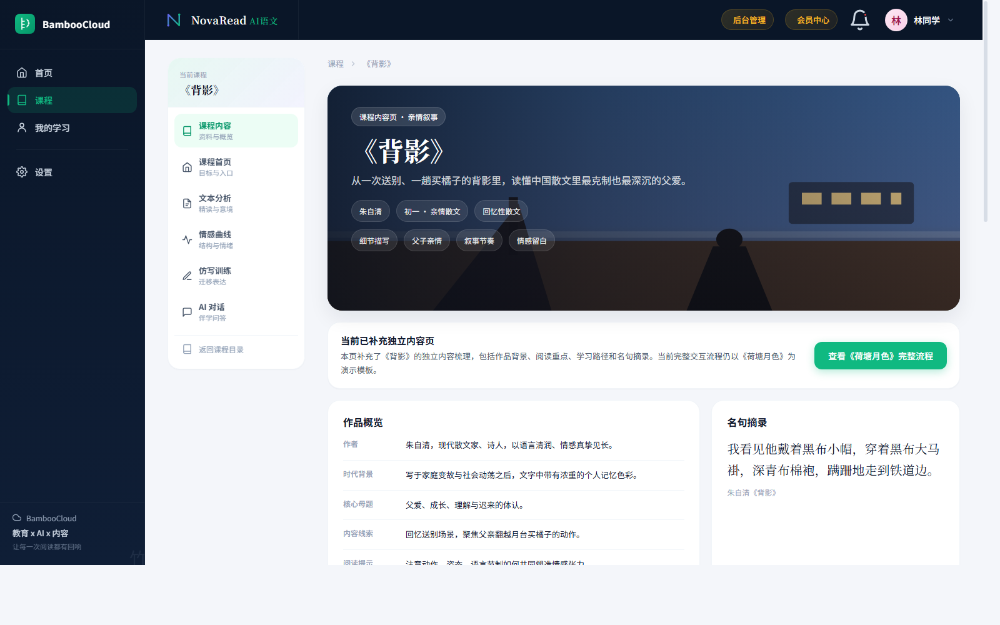
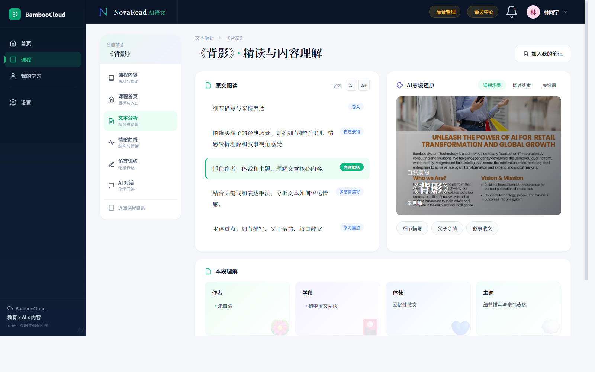
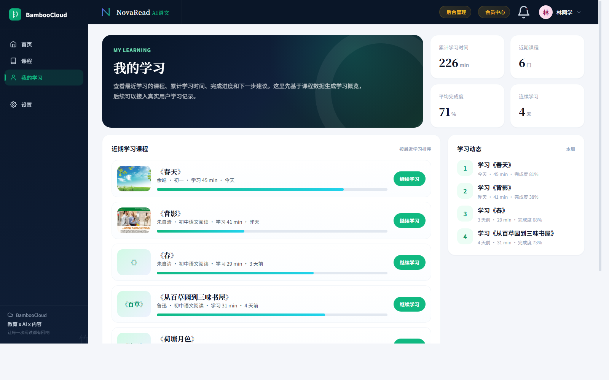
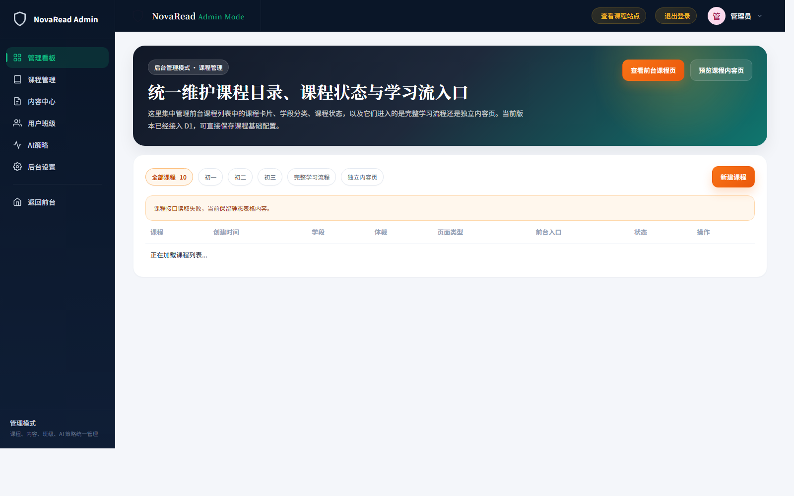

# NovaRead AI语文平台功能介绍

版本：v1.0  
日期：2026-04-27  
平台名称：NovaRead AI语文

## 一、平台定位

NovaRead AI语文是一个面向初中语文阅读学习的智能课程平台。平台围绕“课程阅读、文本理解、结构分析、情感体验、仿写训练、AI对话、学习记录”构建完整学习流程，帮助学生从一篇课文进入系统化阅读与表达训练。

平台适合用于：

1. 初中语文阅读课程学习。
2. 课文精读与写作方法训练。
3. 学生自主学习与复习。
4. 教师或内容运营人员维护阅读课程。
5. 学校或教育机构建设语文AI学习产品原型。

## 二、平台首页与课程入口

平台首页用于展示当前课程学习入口、学习模块和课程目标。学生可以从首页快速进入文本分析、情感曲线、仿写训练、AI对话等学习环节。

核心功能：

1. 展示当前课程标题和学习主题。
2. 提供“开始学习”和“查看课程地图”入口。
3. 展示课程学习模块，包括文本分析、结构拆解、情感曲线、仿写反馈和作者对话。
4. 展示本课学习目标，帮助学生明确学习重点。

## 三、课程中心

课程中心展示平台内所有语文阅读课程。课程以卡片形式呈现，每行展示三个课程，便于学生快速浏览和选择。

核心功能：

1. 展示课程封面、课程名称、作者、学段、体裁和摘要。
2. 支持课程按创建时间排序，最新课程优先展示。
3. 每个课程可配置独立封面图。
4. 点击课程卡片进入课程内容页。
5. 支持展示中国初中阅读课程，例如《荷塘月色》《背影》《春》《从百草园到三味书屋》等。

学生价值：

1. 快速找到要学习的课程。
2. 通过封面和摘要了解课程内容。
3. 从课程入口进入完整学习流程。

## 四、课程内容页

课程内容页是单门课程的学习首页，集中展示课程基础信息、学习目标、阅读路径和课程摘要。

核心功能：

1. 展示课程标题、作者、学段、体裁、标签和封面。
2. 展示课程摘要和阅读提示。
3. 展示作品概览、名句摘录、学习重点和任务建议。
4. 提供进入文本分析、情感曲线、仿写训练、AI对话等页面的入口。
5. 根据当前课程动态展示内容，避免不同课程之间内容混用。

学生价值：

1. 在正式学习前建立整体认知。
2. 明确本课阅读重点。
3. 了解本课的学习路径和目标。

## 五、课程内二级学习菜单

学生进入某一门课程后，页面左侧会出现课程二级菜单。该菜单只在课程学习流程中出现，用于在同一课程内切换学习模块。

二级菜单包含：

1. 课程内容。
2. 课程首页。
3. 文本分析。
4. 情感曲线。
5. 仿写训练。
6. AI对话。

核心价值：

1. 学生始终知道自己正在学习哪一门课程。
2. 切换学习模块时保留当前课程上下文。
3. 避免回到课程列表重新选择课程。
4. 保持完整课程学习路径。

## 六、文本分析

文本分析页帮助学生理解课文内容、作者表达、写作对象和核心主题。页面根据当前课程自动切换内容。

核心功能：

1. 展示当前课程的精读标题。
2. 展示文本阅读内容和段落理解。
3. 根据课程主题生成阅读重点。
4. 展示AI意境还原区域，可显示课程封面或课程场景。
5. 展示与当前课程相关的关键词。
6. 提供AI伴学问题，引导学生继续思考。

学生价值：

1. 帮助学生从“读过课文”走向“读懂课文”。
2. 引导学生抓住作者、体裁、主题和表达手法。
3. 将抽象阅读问题拆解为可理解的学习任务。

## 七、情感曲线与结构分析

情感曲线页用于帮助学生理解文章结构、情感变化和写作线索。平台通过结构地图、情感曲线、关键词云和手法拆解，帮助学生把握文章脉络。

核心功能：

1. 展示文章结构地图。
2. 展示情感变化曲线。
3. 展示关键词云。
4. 展示写作手法拆解。
5. 展示学习洞察和AI总结。
6. 根据当前课程动态替换标题、关键词和分析内容。

学生价值：

1. 理解文章不是零散段落，而是有结构、有推进的整体。
2. 学会观察作者情感如何变化。
3. 建立“结构 + 情感 + 手法”的阅读分析方法。

## 八、仿写训练

仿写训练页帮助学生从阅读走向表达。平台根据当前课程主题生成仿写方向、写作建议和示例说明。

核心功能：

1. 展示当前课程的仿写训练题目。
2. 提供写作输入区域。
3. 展示AI综合评分区域。
4. 提供修改建议。
5. 提供优化示例。
6. 提供与作者相关的写作提示。

学生价值：

1. 将课文中的写作方法迁移到自己的表达中。
2. 获得结构、画面感、修辞、情感表达等维度反馈。
3. 通过示例学习如何优化文字。

## 九、AI对话

AI对话页用于让学生围绕当前课程进行提问和互动。对话伙伴只保留当前课程相关对象，包括作者、文中人物和叙述者。

核心功能：

1. 根据当前课程显示作者。
2. 根据课文内容显示文中人物或叙述者。
3. 不显示与课程无关的人物或通用助教。
4. 提供当前课程相关的推荐问题。
5. 对话内容围绕课程主题、人物关系、作者情感和表达方法。

示例：

1. 《背影》课程可显示朱自清、父亲、我。
2. 《散步》课程可显示莫怀戚、母亲、妻子、儿子、我。
3. 《桃花源记》课程可显示作者、渔人、桃花源中人。

学生价值：

1. 通过对话方式理解课文。
2. 用更自然的方式提问。
3. 从作者和人物视角重新进入文本。
4. 增强阅读沉浸感。

## 十、我的学习

“我的学习”页面用于展示学生近期学习情况，包括最近学习课程、累计学习时间、平均完成度和学习动态。

核心功能：

1. 展示近期学习课程。
2. 展示每门课程学习时间。
3. 展示课程完成度。
4. 展示累计学习时间。
5. 展示连续学习天数。
6. 提供“继续学习”入口。

学生价值：

1. 清楚知道自己最近学了哪些课程。
2. 快速回到上次学习的课程。
3. 了解学习投入和完成情况。
4. 形成持续学习反馈。

## 十一、后台管理

后台管理用于课程运营人员维护课程内容、课程状态和课程封面。管理员可通过后台创建、编辑、删除课程，并管理内容块。

核心功能：

1. 后台登录与权限保护。
2. 课程管理。
3. 新建课程。
4. 编辑课程。
5. 删除课程。
6. 上传课程封面图。
7. 内容块编辑。
8. 课程创建时间展示。
9. 课程发布状态管理。

运营价值：

1. 非开发人员也可以维护课程。
2. 新课程创建后可在前台展示。
3. 封面和摘要可以持续优化。
4. 支持课程内容逐步扩展。

## 十二、平台特色

### 1. 以课程为中心

平台所有学习模块都围绕当前课程展开。学生进入课程后，文本分析、情感曲线、仿写训练和AI对话都会自动关联当前课程。

### 2. 阅读与表达结合

平台不仅帮助学生理解课文，也通过仿写训练帮助学生提升表达能力。

### 3. 视觉化阅读理解

通过结构地图、情感曲线、关键词云和场景图，把抽象的阅读理解变得更直观。

### 4. 对话式学习

AI对话让学生可以用自然提问的方式理解作者、人物、主题和写法。

### 5. 支持持续运营

后台管理让课程可以持续新增、编辑和优化，适合长期建设语文阅读课程库。

## 十三、适用课程类型

平台适合承载以下类型课程：

1. 现代散文。
2. 写景散文。
3. 叙事散文。
4. 亲情主题文章。
5. 童年回忆类文章。
6. 古诗文阅读。
7. 说明文和议论文拓展课程。

## 十四、当前已覆盖的典型课程

平台当前围绕中国初中阅读课程设计，已支持或可扩展到：

1. 《荷塘月色》。
2. 《背影》。
3. 《春》。
4. 《从百草园到三味书屋》。
5. 《紫藤萝瀑布》。
6. 《济南的冬天》。
7. 《散步》。
8. 《社戏》。
9. 《桃花源记》。
10. 《岳阳楼记》。

## 十五、后续功能方向

后续可继续扩展：

1. 真实学生账号体系。
2. 真实学习时长记录。
3. 真实AI对话能力。
4. 教师班级管理。
5. 学生作文提交与批改。
6. 学习报告导出。
7. 课程知识点标签体系。
8. 课文原文分段精细化管理。

## 十六、总结

NovaRead AI语文平台以“课程学习流程”为核心，把传统语文阅读拆解为课程内容、文本分析、结构情感、仿写训练和AI对话等模块。平台既面向学生提供清晰、沉浸、可持续的学习体验，也面向教师和运营人员提供课程维护能力。

该平台适合继续发展为面向初中语文阅读的AI学习产品、教学辅助平台或学校语文数字课程系统。

